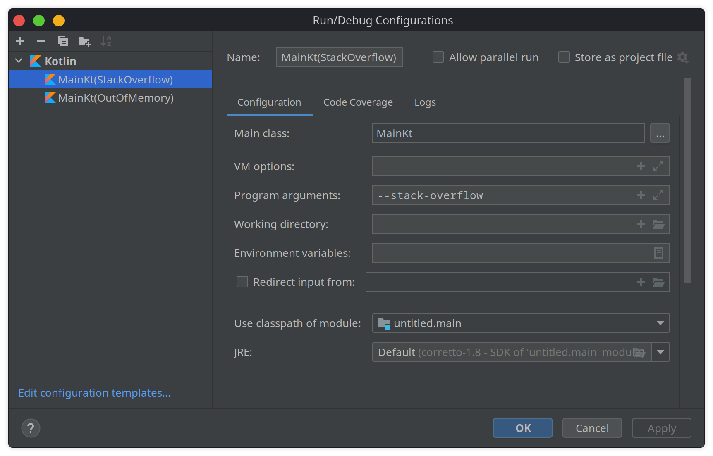
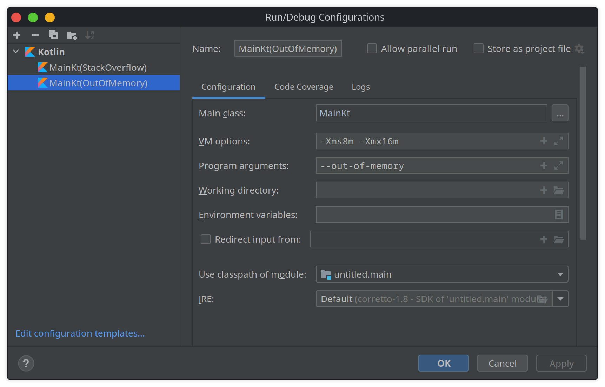

## Test project

Консольная программа запскается с двумя возможными параметрами (см. код)

В идее можно настроить на исполнение 2 следующие конфигурации:

> на этом тесте можем посмотреть сколько вложенных вызовов может быть осуществленно, так как каждый вызов функции расходуют память стека.

> этот тест для памяти хипа. стандартные настройки jvm с большим хипом, поэтому устанешь ждать креша. из-за этого уменьшим размер хипа параметрами.

В этом примере можно попробовать отловить ошибки `StackOverflowError` и `OutOfMemoryError`, попробовать их обработать.
